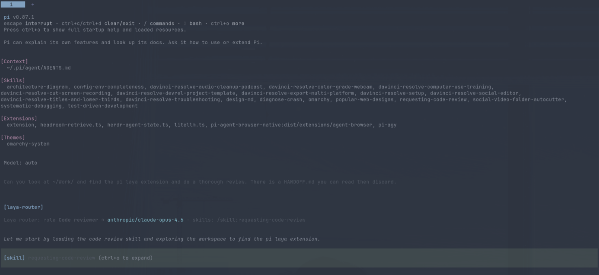

# pi-laya-router

Intent router for the [Pi](https://github.com/earendil-works/pi) coding agent, powered by
[Laya](https://github.com/NandhaKishorM/laya), a small local classifier.

Pick `laya/auto` as your model. Each prompt is classified into one of your configured
**roles** (by default `coding`, `planning`, `ui_ux` or `chat`), and the request goes to the
first healthy model in that role's chain on your OpenAI-compatible proxy (LiteLLM, Headroom,
anything with `/v1/chat/completions`). Pi keeps showing `laya/auto`. When the kind of work
changes for a couple of turns in a row, the session is compacted with a note about the move
and the model is told which skills to load.

## How it looks



## Install

```bash
git clone https://github.com/codenamekt/pi-laya-router
cd pi-laya-router
scripts/install.sh   # laya via uv (Python 3.12), systemd user unit on :8811, config template
```

Then edit `~/.pi/agent/laya-router.json`: set `headroom.baseUrl` to your proxy, and give each
role a model chain the proxy knows. The API key comes from `HEADROOM_API_KEY` (or
`~/.config/headroom/env`).

Try it with `pi -e ./extension`, then `/model laya/auto`. To keep it, add
`<repo>/extension/index.ts` to `extensions` in `~/.pi/agent/settings.json` (and then stop
passing `-e`, or the extension loads twice).

## Roles

A role is what the router routes *to*. Each one has a name, a short description, a model
chain and the skills that go with it:

```json
{
  "roles": {
    "reviewer": {
      "name": "Reviewer",
      "description": "review a diff or PR, find bugs, comment on code quality",
      "models": ["anthropic/claude-sonnet-5", "google/gemini-3.7-flash"],
      "skills": ["code-review"],
      "hint": "Act as a reviewer: read the whole change, look for correctness bugs first, then quality.",
      "enabled": true
    }
  }
}
```

| Field | Meaning |
|---|---|
| key (`reviewer`) | Role id: the classifier label, what `/router force` takes, what the log records. Lowercase, digits, `_` or `-`. The id itself steers Laya, so keep it descriptive (`ui_ux` scores better than `designer` on "make the button blue"). |
| `description` | **Required.** What requests belong here. This is the whole classifier prompt for the role, so keep it short, concrete and distinct from the others. |
| `models` | **Required.** Model ids in preference order. The first one that has not failed recently is used. A string is accepted as a one-model chain. |
| `name` | Display name. Defaults to the id. |
| `skills` | Skill names the model is told to load while the role is active. Skills Pi does not have are skipped silently and flagged by `/router roles`. |
| `hint` | Guidance appended to the system prompt while the role is active. Defaults to a line built from the name and description. |
| `enabled` | `false` keeps the role in the file but stops classifying against it or routing to it. |

The legacy `intents` block with `model`, `skill` and `criteria` still loads, with a
deprecation warning per field.

### Model chains

When a run ends in an error, the model that served it is marked failed for
`chain.retryAfterMs` (five minutes by default) and the next model in the role's chain takes
over. Errors Pi retries by itself (rate limits, 5xx, dropped streams) land on the next model
through Pi's own retry. Errors Pi does not retry (an unknown model id, a 400) are re-run
once per remaining chain entry with the failed reply omitted from context, unless
`chain.failover` is `false`. A model that is down is down for every role that lists it.

### Where the config lives

Layers are read in this order, each optional, each in the same shape as
`laya-router.example.json`:

1. built-in defaults
2. `~/.pi/agent/laya-router.json` (or the file named by `LAYA_ROUTER_CONFIG`)
3. `~/.pi/agent/laya-router.d/*.json`, sorted by name
4. `<project>/.pi/laya-router.json`
5. `<project>/.pi/laya-router.d/*.json`

Sections such as `thresholds` merge field by field. The first layer that defines `roles`
starts the set (the built-in roles apply only when no file defines any); later layers merge
per role, so a drop-in or a project file can add a role, override just `models` on an
existing one, or set a role to `null` to remove it. Commit a project file to give a repo its
own routing rules; use the drop-in directory for rules you want to share without touching
someone's main file.

Everything is validated after merging. Unusable roles are dropped, bad values fall back to
the defaults, and nothing throws: every problem is listed by `/router config`, with a
one-line notice at session start. `laya-router.schema.json` gives editors completion and
validation; the example file references it via `$schema`.

## Commands

```
/router                 status
/router roles           every role with its chain and skills (? unknown to Pi, ✗ failed recently)
/router force planning  pin a role
/router clear           unpin
/router off | on        pause / resume classification
/router config          config layers loaded and every validation issue
/router reload          re-read the config without restarting Pi (provider URL needs a restart)
```

## How it decides

- Laya answers one multiple-choice question about the latest prompt in ~35 ms on a GPU.
  If it is unsure or down, a one-line classification runs through `fallback.model`
  (use a non-reasoning model there).
- A switch needs two consecutive turns at >=0.70 confidence, or one at >=0.90, plus a 0.15
  margin over the runner-up and three turns since the last switch. Tune under `thresholds`.
- Compaction happens on a switch only in interactive modes and only above
  `compactMinTokens` (Pi keeps the last 20k tokens verbatim, so the default is 24k).
- Picking any other model pauses routing. Pick `laya/auto` again to resume.
- Every decision is appended to `~/.pi/agent/laya-router/decisions.jsonl`. Laya's base
  checkpoint is not tuned for this, so once you have a few hundred rows, fine-tune with
  Laya's notebook and point `laya.model` at the result.

## Test

```bash
node --test extension/*.test.ts     # policy, roles, config layering and validation
scripts/classify.sh "plan the auth migration"
scripts/rpc-switch-test.py          # drives Pi over RPC through a forced switch and compaction
```

Public domain, see LICENSE.
